# 01 — 系统上下文

## 目的

定义 ESPocket 设备边界、外部参与者和输入输出关系，避免把构建、网络或诊断工具误认为设备运行时 Owner。

## 支撑的产品要求

- [OVR-001、OVR-002、OVR-004、OVR-005](../product/01-overview.md)
- [AIN-001、AIN-003、AIN-011、AIN-012](../product/02-ai-native.md)

## 结构

用户通过 Shell、App、Assistant 和物理输入使用产品。Build Pipeline 提供 firmware 与受控的内置 package；网络来源提供时间、Catalog 和远程 package；诊断工具观察产品，但不参与设备运行时决策。

## 架构不变量

| ID | Invariant |
|---|---|
| CTX-001 | 用户可见行为必须由 ESPocket 产品 Surface、App 或语义能力提供，不能直接暴露 Framework 或 HAL 对象。 |
| CTX-002 | Build Pipeline、网络来源和诊断工具位于设备运行时边界之外。 |
| CTX-003 | 网络 Catalog 与远程 package 始终作为不可信输入进入产品。 |
| CTX-004 | 诊断输出可以观察运行结果，但不能成为正常运行所需的控制路径。 |
| CTX-005 | 固定系统入口不依赖网络或 Assistant 才能启动和恢复。 |

## AI Native

Assistant 是用户目标进入产品语义的访问方式，不是外部状态 Owner。它只能使用真实 Owner 注册的 Context、Action 和 Event；每次访问继续受实际调用者、User Intent、Scoped Grant 与产品风险规则约束。

Exposure Decision：系统上下文开放稳定产品语义，不开放 Build Pipeline、诊断通道、Framework 对象或原始硬件输入。

## Code Anchors

- [app_main.cpp](../../../firmware/main/app_main.cpp)
- [firmware CMakeLists.txt](../../../firmware/CMakeLists.txt)
- [main CMakeLists.txt](../../../firmware/main/CMakeLists.txt)
- [system.cpp](../../../firmware/components/espocket_system/src/system.cpp)
- [idf_component.yml](../../../firmware/main/idf_component.yml)

## 非目标

- 描述某次构建、烧录或验收结果。
- 定义网络供应商、Assistant 供应商或诊断工具实现。
- 把设备外部参与者建模成产品状态 Owner。
