# 总体分层架构

这张图回答：产品功能如何沿单向依赖，从 ESPocket 自有代码下沉到框架、平台和硬件？

## 依赖规则

1. ESPocket 产品代码可以依赖 ESP-Brookesia 的公开接口，反向依赖禁止。
2. Circular Shell 负责圆屏体验；espocket::System 负责产品装配和跨模块编排。
3. App 通过 AppContext、GUI 与框架 Service 接口获得能力，不访问 Circular Shell 的实现。
4. System Core 是深模块：App 安装、生命周期、GUI、Runtime 与包扫描复杂度应留在其实现内部。
5. 设备差异通过现有 HAL、Board Manager 和显示 Adapter seam 隔离；ESPocket 不重新实现这些框架能力。

## 关键 seam

| Seam | 接口 | 当前 Adapter |
|---|---|---|
| App 生命周期 | IApp / AppContext / System Core 生命周期操作 | Native IApp、Runtime JS backend |
| 产品 Shell | CircularShell 的 IApp 接口与注入回调 | CircularShell |
| GUI | Brookesia GUI backend | GUI LVGL backend |
| 显示来源 | DisplaySource 与 Display Service | ESP LVGL Adapter |
| 板级能力 | Brookesia HAL 与 Board Manager 接口 | Waveshare 1.75C board configuration |

只有一个当前 Adapter 的位置是既有框架 seam，不应据此在 ESPocket 中再增加 Factory、Registry 或空接口。

## 源码锚点

- firmware/components/espocket_system/CMakeLists.txt
- firmware/components/shell_circular/CMakeLists.txt
- firmware/main/idf_component.yml
- firmware/components/gen_bmgr_codes/

