# 核心模块协作

这张图回答：运行时有哪些核心模块，它们通过哪些小接口协作？

## 模块深度

### espocket::System

调用者只需要 init 和继承自 System Core 的 start/stop 生命周期。内部集中处理：

- ServiceManager 与显示来源启动；
- Native、Official、Runtime 与 Shell 的装配；
- 前台 App 跟踪和 generation；
- Launch Source、Back、Home 与生命周期恢复；
- PWR、息屏、唤醒和显示背光；
- Runtime stop failure 后的键盘 fail-closed。

如果删除该模块，这些规则会散落到 app_main、Shell 和各 App，因此它具有真实深度。

### CircularShell

对外暴露 IApp 生命周期、少量 Surface 操作和键盘显示接口。其实现隐藏：

- JSON UI 与 Screen Flow；
- Watch Face、Cards、Quick Settings、Launcher；
- 手势仲裁与单次 intent 消费；
- Wi-Fi、Battery、SNTP、Brightness 状态；
- 系统键盘 Overlay。

### System Core

ESPocket 只通过公开接口安装和驱动 App，不复制 App Manager、Runtime Manager、GUI Runtime、Timer 或 Package Manager。测试也应优先跨同一个公开 seam 验证行为。

## 源码锚点

- firmware/components/espocket_system/include/espocket/system.hpp
- firmware/components/espocket_system/src/system.cpp
- firmware/components/shell_circular/include/espocket/circular_shell.hpp
- firmware/components/shell_circular/src/circular_shell.cpp

