# 04 — 启动与生命周期

## 目的

定义设备启动顺序、失败分类、App 生命周期和语义能力失效顺序，确保 Native 与 Runtime App 共用同一状态事实。

## 支撑的产品要求

- [OVR-002、OVR-003、OVR-011–OVR-015](../product/01-overview.md)
- [APP-004、APP-005、APP-006、APP-010、APP-011](../product/04-app-contract.md)
- [AIN-006、AIN-007、AIN-008](../product/02-ai-native.md)

## 结构

## 架构不变量

| ID | Invariant |
|---|---|
| LIF-001 | ServiceManager 与显示来源必须先于 System Core 和 App 启动。 |
| LIF-002 | Display、Touch、System Core 或 Shell 基础启动失败必须终止启动并返回错误。 |
| LIF-003 | Time、Wi-Fi 与 Battery 状态不可用不得阻止 Home 启动，Shell 使用明确降级状态。 |
| LIF-004 | Native 与 Runtime App 共用 System Core 的 App 状态机、前台跟踪和恢复 Hook。 |
| LIF-005 | App 停止必须先使外部访问失效，再释放实例拥有的 GUI、Timer、订阅和临时状态。 |
| LIF-006 | 被回收或失效的实例不得恢复旧页面；再次启动产生新的 Root 与实例 identity。 |
| LIF-007 | 同一 ESPocket System 对象必须支持正常 stop→start 与 deinit→init；重新运行重建所需 binding、请求关系和输入状态，不复用已失效的 App Running Instance。关键启动失败不承诺原地重试。 |
| LIF-008 | System stop 撤销产品执行入口并停止所有受管 App；deinit 进一步释放资源。Service 继续遵守真实 Owner 与 binding 生命周期，不通过复制生命周期状态达成停机。 |

## AI Native

App 只有进入 Running 后才能注册属于该实例的 Context、Action 和 Event。停止、崩溃、重启或回收先撤销可发现性和调用能力，再清理实例；重新启动产生新的注册 identity。跨 App 生命周期持续的能力由 Brookesia Service 拥有。

Exposure Decision：System、Shell 和 Service 可以注册与各自生命周期一致的能力；App 能力不得超出单次 Running Instance。

## Code Anchors

- [app_main.cpp](../../../firmware/main/app_main.cpp)
- [system.cpp](../../../firmware/components/espocket_system/src/system.cpp)
- [circular_shell.cpp](../../../firmware/components/shell_circular/src/circular_shell.cpp)
- [System Core app manager](../../../firmware/managed_components/espressif__brookesia_system_core/src/app/manager.cpp)

## 非目标

- 建立第二套 Native/Runtime 生命周期。
- 保证 App 后台驻留或恢复失效页面对象。
- 用诊断日志替代生命周期 Interface 的结果。

## PWR 输入与执行上下文

PowerKeyMonitor 只采样和暂存短按事件，System 消费并执行 Home、Screen Off 或 Wake。Circular Shell 不读取按键计数、不转发 PWR Home；其通用 ShellHost tick 提供维护节拍。同一处理周期中的 PWR 先于未提交的键盘或确认结果，已提交操作仍由真实 Owner 核实。App 启动等待不得阻塞 PWR Home 的产品响应目标。

停止时 System 先撤销产品执行入口并设置 stopping guard，停止按键采样，再停止 Shell 与全部受管 App，防止旧输入进入新运行；deinit 进一步释放资源。正常重复运行与关键失败后显式重启的保证分开。
