# 导航与应用运行

这张图回答：Shell Surface、App 页面、Back、Home、息屏和唤醒如何组合。

## 顶层 Surface

当前 ShellSurface 枚举包含 WatchFace、BatteryCard、BrightnessCard、QuickSettings 和 Launcher。App 运行时不属于 ShellSurface；它由 System Core 作为前台可见 App 管理。

## 导航职责

| 决策 | 负责模块 |
|---|---|
| 手势是否达到阈值、属于哪个 Surface | CircularShell |
| manifest ID 对应哪个已安装 App | System Core + espocket::System |
| 记录直接 Launch Source | espocket::System |
| Detail Back 返回 Root | App 的 main Screen Flow |
| Root Back 停止 App 并恢复来源 | espocket::System |
| PWR Home、息屏、唤醒 | espocket::System + PowerKeyMonitor |
| 页面 GUI、Timer 与 action | AppContext |

## 显示状态与导航正交

息屏不执行 Back 或 Home。系统保存可恢复的前台 App ID；唤醒时只有目标仍处于有效 Running 状态才恢复，否则降级到 Watch Face。

## App 类型

Runtime 包的来源和信任策略不会改变这套运行期交互契约；未通过信任门的动态包不得进入可启动集合。

## 源码锚点

- firmware/components/shell_circular/include/espocket/circular_shell.hpp
- firmware/components/shell_circular/src/circular_shell.cpp
- firmware/components/espocket_system/src/system.cpp
- ../product/app-contract.md
