# 06 — 设备能力映射

## 目的

定义显示、触控、电源、网络、时间、存储和 Runtime 能力从产品调用者到 Framework Interface、Adapter 与硬件的路径。

## 支撑的产品要求

- [OVR-002、OVR-005、OVR-006](../product/01-overview.md)
- [TRU-001–TRU-010](../product/05-runtime-package-trust.md)
- [SCA-001–010](../product/08-system-capability-alignment.md)
- [AIN-004、AIN-005、AIN-008、AIN-012](../product/02-ai-native.md)

## 结构

| 产品能力 | 调用者 | Framework Interface | Adapter / Platform |
|---|---|---|---|
| 显示启动与背光 | `espocket::System` | Display Helper、`DisplaySource` | GUI LVGL、ESP LVGL Adapter |
| Watch Face 与 App GUI | CircularShell / App | GUI backend、`AppContext` GUI | LVGL、AMOLED |
| 触控与 Edge Back | CircularShell | Display gesture event | Touch driver |
| PWR 短按 | PowerKeyMonitor | GPIO input | Board wiring |
| Battery | CircularShell | Device Helper | Device Service、PMIC |
| Brightness | CircularShell / System | Display Helper | Display Service、backlight Adapter |
| Wi-Fi 与 Time | CircularShell / Settings | Wi-Fi / SNTP Helper | ESP-IDF network、NVS、system time |
| Runtime package | System Core | Package / Runtime Interface | LittleFS、Runtime JS |
| Store network | Official App Store | HTTP Service | ESP-IDF network、TLS |

## 能力 Owner 与 Adapter

| Capability | 事实与副作用 Owner | ESPocket seam |
|---|---|---|
| 状态有效性 | Wi-Fi、SNTP、Device Service | Circular Shell 格式化和有限呈现快照；System 生命周期控制 |
| 调试采集 | ServiceManager 的 Utils / Profiler；Settings 业务控制 | Settings 准入适配、System 订阅、Shell 浮层；共享采集权必须在 Utils 内核实 |
| 字体、语言与主题 | Core/GUI Runtime 环境与偏好；App 文案 | System 预载与 change hook；Shell 刷新原生控件，App 更新自身动态文案 |
| Files | 官方 Files 业务与 Storage IO；Core 包/路径准入 | 精确版本官方 App 接入；目录边界和执行授权必须位于真正执行路径 |
| 非 GUI source | Display dataflow/provider 与运行 App | System 记录有限恢复 continuation；Shell 只请求临时 GUI 呈现 |
| 手机配网 | Wi-Fi Service/HAL 的 portal 与 STA | System 持有产品会话；Shell 持有页面与入口，不持有密码历史 |
| Expansion | Device ModuleManagerIface | Shell 有限提示合并，Core 持有 Dialog/request identity |

## 架构不变量

| ID | Invariant |
|---|---|
| CAP-001 | 产品 Module 通过 Framework Interface 使用设备能力，不直接复制 Driver 或 HAL Implementation。 |
| CAP-002 | Display、Touch、System Core 与 Shell 属于启动关键路径；失败时不得伪装成可用系统。 |
| CAP-003 | Wi-Fi、Time 与 Battery 属于可降级能力；失败时保持 Home 并表达不可用状态。 |
| CAP-004 | Runtime package 必须先通过统一信任 Seam，再进入可安装和可启动状态。 |
| CAP-005 | Store、HTTP 或 package 路径的问题不得通过 Shell 私有旁路修补。 |
| CAP-006 | Board 差异只进入 Board Manager、HAL 或能力 Adapter，不扩散到 App。 |
| CAP-007 | 呈现快照可记录 sample time、validity 和 generation，但不接受 App/GUI 写回成为 Service 的事实源；执行时仍向真实 Owner 重新判断。 |
| CAP-008 | callback 不在持有产品状态锁时同步等待 GUI 或 Service；只传递有限数据，Owner 消费时重核 Running Instance/session generation。停止先关闭 admission 与 continuation，再清理 timer/订阅/binding。停止安全必须由真实 Owner 的清理结果证明。 |
| CAP-009 | 主题/语言更新覆盖 GUI 文档与原生 LVGL 控件；不能以重建 App 或再提交请求替代 refresh。Core 环境、实际呈现与持久偏好分别核实。 |
| CAP-010 | Files 的浏览过滤与写操作检查必须汇合到真实执行边界；禁止依靠隐藏按钮或 Shell 缓存的路径进行授权。官方 Files 的导航例外须单独决策，ADR-0012 不自动扩展。 |
| CAP-011 | 显示恢复 continuation 只保存选定 output、source/operation identity 与 Running Instance；嵌套系统 UI 不覆盖首次记录，最后一个有效系统层退出才恢复。Home/stop/revoke 清除恢复资格。 |
| CAP-012 | 调试采集的观察订阅不等于 stop 权利。退出 Settings 不自动关闭用户已开启的会话；System stop/开发者模式关闭只释放自己拥有的采集，不能停止其他 Owner。 |

## AI Native

| 能力 | Exposure Decision | Owner |
|---|---|---|
| Brightness | 开放读取、设置与变化语义；不暴露 Output ID 或背光 Driver | ESPocket System + Display Service Adapter |
| PWR | 开放 Home、Screen Off 与 Wake 产品语义；不暴露原始 GPIO 电平 | `espocket::System` |
| Wi-Fi、Battery、Time | 只开放用户可理解的状态与获准 Action | 对应 Brookesia Service Owner |
| Store 与 Runtime package | 只有通过信任和授权规则的安装语义可以开放 | System Core / Store |
| App 自有能力 | 由 App 声明稳定语义，并绑定单次 Running Instance | Native / Runtime App |

诊断与内部显示路由明确 unexposed；其余新增能力维持 deferred，按真实 Owner 的 Context/Action/Event、调用者授权及 Running Instance 设计。具体目标 seam 见[开发契约](../../development/system-capability-seams.md#exposure-decision)。

## Code Anchors

- [system.cpp](../../../firmware/components/espocket_system/src/system.cpp)
- [power_key_monitor.cpp](../../../firmware/components/espocket_system/src/power_key_monitor.cpp)
- [circular_shell.cpp](../../../firmware/components/shell_circular/src/circular_shell.cpp)
- [Board Manager generated interface](../../../firmware/components/gen_bmgr_codes)
- [idf_component.yml](../../../firmware/main/idf_component.yml)
- [Waveshare 1.75C schematic](https://files.waveshare.com/wiki/ESP32-S3-Touch-AMOLED-1.75C/ESP32-S3-Touch-AMOLED-1.75C-schematic.pdf)

## 非目标

- 记录能力的验收状态或上游阻塞。
- 在产品层重写 Framework Service、HAL 或 Driver。
- 把原始硬件 Interface 自动暴露给 Assistant。
