# AI Native 架构

> 文档类型：跨模块目标架构视图。术语以根目录 `CONTEXT.md` 为准，实施状态由 `.scratch/` 与 Milestone 判定。

这张图回答：AI Native 如何进入现有 System、Shell、Service 和 App，而不建立第二套状态与生命周期系统？



## 结构

```text
User Intent / Scoped Grant
            ↓
        Assistant
            ↓
 Permission + Action Risk
            ↓
 Semantic Registration
            ↓
 System | Shell | Service | App
          real Owners
            ↓
 Brookesia public seams / HAL adapters
```

AI Native 是横向语义访问维度。Owner 继续保有状态、副作用、资源和生命周期；Assistant 组合用户目标并调用获准语义，不保存一份竞争状态。

## 注册边界

每项注册包含：

- 稳定 identity 与 Owner；
- 可读 Context、可请求 Action 或可观察 Event；
- Permission 与 Action Risk；
- 注册和失效生命周期；
- 结果、失败和不确定状态的语义。

注册产品语义，不注册 GUI 控件、任意 C++ 方法、HAL handle 或完整对象转储。一个能力若尚无稳定产品语义，可以明确不暴露或延后。

## 调用与授权

```text
discover description
  → obtain Context or propose Action
  → bind actual caller
  → match User Intent / Scoped Grant
  → apply product risk policy
  → apply Owner and Brookesia admission
  → execute at Owner
  → report observed result
```

App 或 Agent 请求本身不构成 User Intent。产品 UI 与 Assistant 可以共享同一 Action seam，但各自携带实际调用者并独立判权。高影响步骤需要单独确认。

提交后的结果若不明确，系统报告不确定状态，不盲目重试。取消只能阻止尚未提交的步骤；已经进入 Owner 的工作依照 Owner 契约完成或失败。

## Owner 映射

| Owner | 负责内容 | AI Native 关系 |
|---|---|---|
| ESPocket System | 产品装配、跨模块策略、PWR 与显示编排 | 注册系统级语义或连接能力 Adapter |
| Circular Shell | Surface、导航、Overlay 与可见状态 | 注册 Shell 产品语义，不暴露 LVGL 对象 |
| Brookesia Service | 跨 App 持续设备或业务能力 | 通过 public Function/Event 与防腐 Adapter 承接 |
| Native App | App 自有状态和操作 | 绑定一次 Running Instance |
| Runtime App | 包内 App 状态和操作 | 同一语义契约，受 Runtime 与包信任准入 |

## 生命周期

- System 注册随 System 生命周期存在。
- Shell 注册随 Shell 生命周期存在。
- Service 注册随有效 binding 和 Service 生命周期存在。
- App 注册随一次 Running Instance 存在，旧实例停止后不可复用。
- Capability Discovery 只描述当前可用能力，不授予访问权。

## 第一条 seam

显示亮度是首条目标能力，因为现有 Display Service 已拥有读取、设置和变化事件。ESPocket 需要一个能力专用 Adapter，将稳定的亮度语义映射到锁定版公开接口，并复用 System 已选中的显示输出事实。

这条 seam 用来验证 Owner、Context、Action、Event、授权、取消和结果观察。它不提前创建通用 Provider、Factory 或全局 AI Manager；第二个真实能力出现后再提取共同结构。

## 设计完整性

每个新系统设计必须记录 Exposure Decision：

1. 注册：定义语义、Owner、授权和生命周期。
2. 不暴露：说明为什么不应形成 AI 能力。
3. 延后：建立可执行 ticket，并保持当前能力不可发现。

这个要求同时适用于人类 UI 的新能力。UI 可用不自动意味着 Assistant 可用，Assistant 可发现也不自动意味着获权。

## 决策与实施

- [ADR-0006](../../adr/0006-ai-semantic-access-stays-with-real-owners.md)：真实 Owner 保持所有权。
- [ADR-0007](../../adr/0007-ai-authority-comes-from-user-goals.md)：授权来自用户目标。
- [ADR-0008](../../adr/0008-app-ai-capabilities-follow-the-running-instance.md)：App capability 跟随 Running Instance。
- [ADR-0009](../../adr/0009-ai-native-is-a-foundational-design-dimension.md)：所有系统设计都要作 Exposure Decision。
- [AI Native Spec](../../../.scratch/009-ai-native-foundation/spec.md)：分阶段实施与验收。
- [本地上游快照](../../upstream/ai-native-local-baseline-2026-09-29.md)：特定依赖锁下的 API 事实。
