# 08 — 交互自动化 Seam

## 目的

定义设备测试入口如何驱动真实交互 Owner，并划清合成输入、物理输入和视觉证据的覆盖边界。

## 支撑的产品要求

- [DEV-001–DEV-006](../product/07-developer-mode-testing.md)
- [INT-004、INT-007、INT-018、INT-022–INT-025](../product/03-interaction-model.md)
- [APP-021–APP-028](../product/04-app-contract.md)

## 结构

主机 Test Driver 经 USB 协议到 ESPocket Test Adapter。Adapter 校验设备开发者模式并把合成触摸送至 Display / Shell 的正式输入处理入口，把语义 PWR 送至 System；状态快照从各 Owner 只读取得。Test Driver 不写入页面栈或 Surface 状态。

## Owner 与 Interface

| Owner / Module | 负责的事实 | 对测试开放的 Interface |
|---|---|---|
| Brookesia Display Service | 硬件触摸、LVGL 输入与基础手势 | 合成触摸注入；真实触摸继续从硬件进入 |
| CircularShell | Home Space Surface、滚动与手势仲裁 | 共用输入处理入口；只读 Surface 快照 |
| ESPocket App Navigator | 声明过的 App Page 栈、Back 状态 | 只读当前 Page ID、`canBack`、`backPending` |
| `espocket::System` | 前台 App、Home、PWR、Display State | 语义 PWR 入口；只读系统快照 |
| Test Adapter | 开发者模式准入、协议、注入清理 | `hello`、`stimulus`、`snapshot`、`release` |
| 主机 Test Driver | 用例编排、等待、断言与证据标记 | [版本化开发协议](../../development/interaction-test-protocol.md) |

锁定版 Display Service 的 `inject_touch()` 影响 LVGL 输入快照，但其手势识别仍读取硬件快照。因此测试用合成触摸驱动 Shell 手势时，需要 ESPocket 的共用输入处理入口；仅调用 `inject_touch()` 不足以证明 Shell 手势路径。合成 PWR 证明 System 语义，不证明 GPIO 电气链路。

CircularShell 的硬件手势订阅把 Brookesia 事件转换为 `ShellGestureEvent`，与内部 `handle_gesture` 输入入口共同调用 `process_shell_gesture`。该仲裁模块只更新 Shell 自己的输入状态和 pending intent；Surface/Back 的执行继续在原 App callback task。它不依赖 LVGL 对象，也不为 Test Adapter 建立第二套导航状态。此共享入口已实现；USB 原始轨迹、LVGL 注入、占用与取消仍按 012/02 实施，尚未作为 USB capability 公布。

## 架构不变量

| ID | Invariant |
|---|---|
| TST-002 | 测试只通过 Owner Interface 驱动与观察，不复制 Surface、App Page 或 Display State。 |
| TST-003 | 每个输入序列都必须显式结束触摸、清除注入，并在超时或连接断开时释放覆盖。 |
| TST-004 | 快照带单调序号；Test Driver 等待目标状态，不以固定 sleep 或日志文案作为唯一断言。 |
| TST-005 | 报告区分 `synthetic-input`、`physical-input` 和 `visual` 证据；前者不能满足硬件触摸或画面验收。 |
| TST-006 | Test Driver 不通过 Assistant、GUI 坐标点击框架或 App 私有字段执行 Home、Back、PWR 语义。 |
| TST-007 | 正式固件可包含 Test Adapter，但所有命令都经过设备开发者模式准入；模式默认关闭并持久保存。 |
| TST-008 | 首版测试通道只接受 USB 上的合成触摸、语义 PWR、快照和释放；不得借测试协议执行任意 App Action 或更改产品设置。 |
| TST-009 | Page 快照来自 ESPocket 唯一导航栈，只暴露 App ID、Page ID、`canBack` 和 `backPending`；不序列化页面参数或完整栈。 |

## AI Native

Exposure Decision：测试协议是本地开发能力，不注册为 Assistant 可调用的 Action、Context 或 Event；Assistant 的 Home 和 Back 继续走正式语义接口。

## Code Anchors

- [ESPocket Test Adapter](../../../firmware/components/espocket_test_adapter/include/espocket/interaction_test_adapter.hpp)：产品层 USB Serial/JTAG 入口与版本化协议；Native 和 Runtime 共用这一入口。
- [DeveloperMode](../../../firmware/components/espocket_test_adapter/include/espocket/developer_mode.hpp)：设备端持久准入开关。
- [CircularShell](../../../firmware/components/shell_circular/include/espocket/circular_shell.hpp)
- [System](../../../firmware/components/espocket_system/include/espocket/system.hpp)
- [Display Service](../../../firmware/managed_components/espressif__brookesia_service_display/include/brookesia/service_display/service_display.hpp)

## 非目标

- 在 Test Driver 重实现产品导航状态或手势仲裁。
- 用合成输入替代真实触摸与视觉验收。
- 为单个 Shell 建立通用 Factory 或 Registry。
